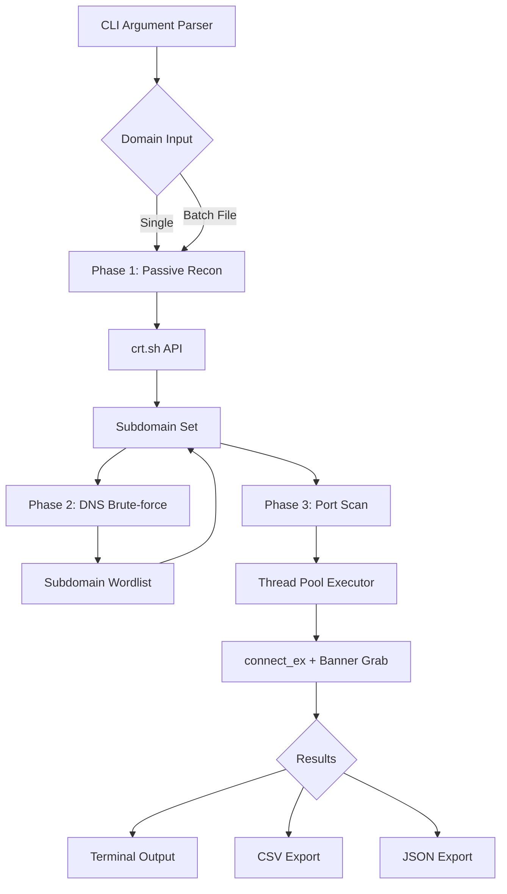
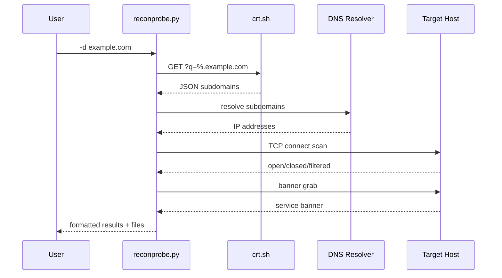

# ReconProbe

Automated reconnaissance toolkit — subdomain discovery, port scanning, and service enumeration rolled into one CLI tool. Written for HTB/VulnHub box enumeration, bug bounty scope mapping, and internal network assessments.

Combines passive (crt.sh certificate transparency logs) and active (DNS brute-force, TCP port scanning) techniques with threaded parallelism. No database, no daemon, no bullshit — just Python and a shell.

## Features

- **Passive recon** — pulls subdomains from crt.sh certificate transparency logs
- **DNS brute-force** — built-in common subdomain wordlist or your own
- **Port scanning** — multi-threaded TCP scanner with banner grabbing
- **Service detection** — attempts to identify services on open ports
- **Batch mode** — process multiple domains from a file
- **Export** — JSON, CSV, and terminal output

## Quick Start

```bash
pip install requests
python3 reconprobe.py -d example.com
```

```bash
# Quick scan (no passive, no brute, just ports)
python3 reconprobe.py -d scanme.org --quick

# Full aggressive scan
python3 reconprobe.py -d target.com --aggressive -o ~/recon_results/

# Batch from file
python3 reconprobe.py -l domains.txt -o ./batch_output/

# Custom ports
python3 reconprobe.py -d example.com --ports 22,80,443,8443,3306,8080
```

## Output Structure

```
recon_output/
  example_com/
    subdomains.csv   — hostname, ip
    ports.csv        — ip, port, state, banner
    summary.json     — everything in one file
```

## Todo / Known Issues

- No UDP scanning yet. Good luck with that on a single-threaded Python script.
- crt.sh rate-limits if you hammer it. Add a delay if scanning many domains.
- Banner grabbing is best-effort. Some services don't speak HTTP on connect.
- Resolver can get throttled. For large wordlists, run through a local resolver.

## System Design



## Architecture



## Tech Stack

| Component | Choice | Why |
|-----------|--------|-----|
| Language | Python 3 | Prototype speed, scapy/nmap interop later |
| Networking | socket stdlib | Zero deps for core scanning |
| HTTP | requests | crt.sh and banner probing |
| Parallelism | concurrent.futures | Simple thread pool, good enough for IO-bound |
| Output | CSV + JSON | Machine-parseable, grep-friendly |

## License

MIT — do what you want, don't blame me if you catch a case.
